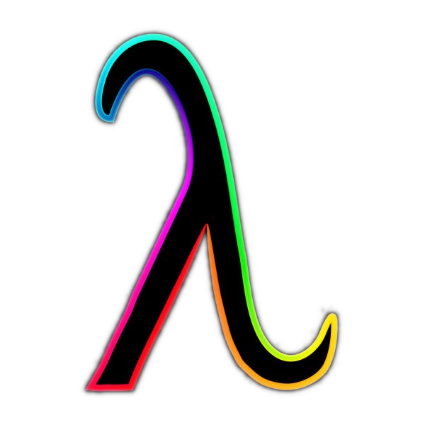

# Functional Contrast

## A Theme inspired by [Tinacious Design](https://marketplace.visualstudio.com/items?itemName=tinaciousdesign.theme-tinaciousdesign) with extra token configuration for haskell and elm
